<div align="center">

<!-- ======================================================
     🚀 HEADER WAVE & HERO BANNER
     ====================================================== -->
<a href="https://vivek-rahagir.com">
  
</a>

<!-- ======================================================
     ⚡ DYNAMIC TYPING SVG
     ====================================================== -->
<p align="center">
  <a href="https://vivek-rahagir.com">
    
  </a>
</p>

<!-- ======================================================
     🔘 QUICK NAVIGATION & STATUS BADGES
     ====================================================== -->
<p align="center">
  <a href="https://vivek-rahagir.com" target="_blank">
    
  </a>
  &nbsp;
  <a href="mailto:vivekhr36.2007@gmail.com">
    
  </a>
  &nbsp;
  <a href="https://t.me/Rahagirrr" target="_blank">
    
  </a>
  &nbsp;
  
  &nbsp;
  
</p>

</div>


<!-- ======================================================
     👤 ABOUT ME (DUAL COLUMN HERO)
     ====================================================== -->
<h2 align="center">
  
  <span> About The Developer </span>
  
</h2>

<table align="center" width="100%">
  <tr>
    <td width="36%" align="center" valign="middle">
      <a href="https://vivek-rahagir.com">
        
      </a>
      <br/>
      <b>Vivek Yadav (Rahagir)</b><br/>
      <sub>🚀 Full Stack Developer & Tech Enthusiast</sub><br/>
      <a href="https://vivek-rahagir.com"><b>🌐 vivek-rahagir.com ↗</b></a>
    </td>
    <td width="64%" valign="top">
      <h3>⚡ Hey, I'm Vivek!</h3>
      <p>
        I'm a passionate <b>Full Stack Web Developer</b> and Computer Science Engineering student at <b>BML Munjal University</b>. I love crafting clean, lightning-fast web applications, dynamic user interfaces, and scalable backend services.
      </p>
      <ul>
        <li>🌐 <b>Live Portfolio:</b> <a href="https://vivek-rahagir.com"><b>vivek-rahagir.com</b></a> (Check out my latest builds & design work)</li>
        <li>🎓 <b>Degree:</b> B.Tech in CSE @ BML Munjal University</li>
        <li>💻 <b>Current Focus:</b> Full Stack Architecture, React / Next.js ecosystem, Distributed APIs</li>
        <li>💡 <b>Passions:</b> Sleek UI/UX aesthetics, high performance, robust backend systems</li>
        <li>🔄 <b>Philosophy:</b> <code>Build</code> ➔ <code>Break</code> ➔ <code>Rebuild</code> ➔ <code>Optimize</code></li>
        <li>📫 <b>Get In Touch:</b> <a href="mailto:vivekhr36.2007@gmail.com">vivekhr36.2007@gmail.com</a></li>
      </ul>
      <blockquote>
        <i>"Code is the closest thing we have to magic — turning sheer human thought into reality."</i>
      </blockquote>
    </td>
  </tr>
</table>

<!-- ======================================================
     🕉️ GUIDING DHARMA
     ====================================================== -->
<div align="center">

### 🕉️ Guiding Philosophy (Dharma)

> ### **"कर्मण्येवाधिकारस्ते मा फलेषु कदाचन।"**
> *“You have a right to perform your prescribed duties, but you are not entitled to the fruits of your actions.”*  
> — **Bhagavad Gita (Chapter 2, Verse 47)**

</div>


<!-- ======================================================
     📸 VISUAL SPOTLIGHT / GALLERY
     ====================================================== -->
<h2 align="center">📸 Visual Spotlight</h2>
<p align="center"><i>The Architect • The Visionary • The Engineer</i></p>

<table align="center" width="100%">
  <tr align="center">
    <td width="33%">
      <a href="https://vivek-rahagir.com">
        
      </a>
      <br/>
      <b>🧠 The Architect</b><br/>
      <sub>Deep Focus • System Logic • Execution</sub>
    </td>
    <td width="33%">
      <a href="https://vivek-rahagir.com">
        
      </a>
      <br/>
      <b>🌅 The Rahagir (Traveler)</b><br/>
      <sub>Curiosity • Horizons • Creative Vision</sub>
    </td>
    <td width="33%">
      <a href="https://vivek-rahagir.com">
        
      </a>
      <br/>
      <b>💼 The Full Stack Engineer</b><br/>
      <sub>Professional Delivery • Scalable Code</sub>
    </td>
  </tr>
</table>


<!-- ======================================================
     🛠️ TECH STACK & ARSENAL
     ====================================================== -->
<h2 align="center">🛠️ Tech Stack & Arsenal</h2>

<div align="center">

<p>
  <b>Frontend:</b>
  <code>React</code> •
  <code>Next.js</code> •
  <code>TypeScript</code> •
  <code>JavaScript (ES6+)</code> •
  <code>TailwindCSS</code> •
  <code>HTML5 / CSS3</code> •
  <code>D3.js</code>
</p>
<p>
  <b>Backend & Database:</b>
  <code>Node.js</code> •
  <code>Express.js</code> •
  <code>MongoDB</code> •
  <code>PostgreSQL</code> •
  <code>REST APIs</code>
</p>
<p>
  <b>DevOps & Workflow:</b>
  <code>Git</code> •
  <code>GitHub</code> •
  <code>VS Code</code> •
  <code>Linux / Unix</code> •
  <code>Vercel</code> •
  <code>Postman</code> •
  <code>Vite</code>
</p>

<br/>

<!-- SKILL ICONS MATRIX -->
<a href="https://skillicons.dev">
  
</a>

</div>


<!-- ======================================================
     🧪 ENGINEERING METRICS & CORE COMPETENCIES
     ====================================================== -->
<h2 align="center">🧪 Core Competencies & Skills</h2>

<div align="center">

```text
[Full-Stack Architecture]   ██████████████████░░   95%
[Frontend UI/UX & Motion]   █████████████████░░░   90%
[Backend & RESTful APIs]    ████████████████░░░░   85%
[Database & State Mgmt]     ███████████████░░░░░   82%
[Problem Solving & Logic]   ██████████████████░░   94%
```

</div>


<!-- ======================================================
     🚀 FEATURED PROJECTS SHOWCASE
     ====================================================== -->
<h2 align="center">🚀 Featured Projects</h2>

<table align="center" width="100%">
  <tr>
    <td width="50%" valign="top">
      <h3>🌐 <a href="https://vivek-rahagir.com">Personal Portfolio Website</a></h3>
      <p>
        Modern, responsive portfolio featuring interactive animations, showcase of technical projects, and sleek dark design.
      </p>
      <p>
        <b>Tech:</b> <code>Modern Web</code> • <code>CSS3</code> • <code>JavaScript</code> • <code>Animations</code><br/>
        🔗 <b>Live Demo:</b> <a href="https://vivek-rahagir.com"><b>vivek-rahagir.com ↗</b></a>
      </p>
    </td>
    <td width="50%" valign="top">
      <h3>🛡️ <a href="https://github.com/vivek-rahagir07">Safe Return</a></h3>
      <p>
        Smart geo-tracking personal safety system built with real-time route monitoring, emergency alerts, and location intelligence.
      </p>
      <p>
        <b>Tech:</b> <code>HTML5</code> • <code>CSS3</code> • <code>JavaScript</code> • <code>Web APIs</code><br/>
        🔗 <b>Source:</b> <a href="https://github.com/vivek-rahagir07">GitHub Repository ↗</a>
      </p>
    </td>
  </tr>
  <tr>
    <td width="50%" valign="top">
      <h3>⚡ <a href="https://github.com/vivek-rahagir07">Open Sourcenry 2.0</a></h3>
      <p>
        Community-driven open-source contribution platform and collaborative developer growth hub designed to streamline project matching.
      </p>
      <p>
        <b>Tech:</b> <code>React</code> • <code>Node.js</code> • <code>Express</code> • <code>MongoDB</code><br/>
        🔗 <b>Source:</b> <a href="https://github.com/vivek-rahagir07">GitHub Repository ↗</a>
      </p>
    </td>
    <td width="50%" valign="top">
      <h3>🌆 <a href="https://github.com/vivek-rahagir07">City Visualizer App</a></h3>
      <p>
        Dynamic API-based urban metrics visualizer rendering real-time city data and environmental statistics into intuitive visual dashboards.
      </p>
      <p>
        <b>Tech:</b> <code>JavaScript</code> • <code>D3.js</code> • <code>Async APIs</code> • <code>Charts</code><br/>
        🔗 <b>Source:</b> <a href="https://github.com/vivek-rahagir07">GitHub Repository ↗</a>
      </p>
    </td>
  </tr>
</table>


<!-- ======================================================
     🏆 GITHUB TROPHIES
     ====================================================== -->
<h2 align="center">🏆 GitHub Trophies</h2>

<div align="center">
  <a href="https://github.com/ryo-ma/github-profile-trophy">
    
  </a>
</div>

<br/>

<!-- ======================================================
     📊 LIVE GITHUB STATS & STREAK
     ====================================================== -->
<h2 align="center">📊 GitHub Activity & Streak</h2>

<div align="center">

  <a href="https://github.com/vivek-rahagir07">
    
  </a>

  <br/><br/>

  <!-- MATRIX SNAKE -->
  <p><b>🟢 Contribution Snake Eating Contributions 🐍</b></p>
  

</div>


<!-- ======================================================
     💻 CURRENTLY VIBING & MISSION CONTROL (ANIMATED TERMINAL)
     ====================================================== -->
<h2 align="center">💻 Mission Control & Current Vibe</h2>

<div align="center">

<p align="center">
  
</p>

<!-- ANIMATED DEVELOPER TERMINAL & TELEMETRY -->
<a href="https://vivek-rahagir.com" target="_blank">
  
</a>

</div>

<br/>

<!-- RANDOM DEV QUOTE -->
<div align="center">
  <a href="https://vivek-rahagir.com">
    
  </a>
</div>


<!-- ======================================================
     📡 CONNECT & COLLABORATE
     ====================================================== -->
<h2 align="center">📡 Connect With Me</h2>

<div align="center">

<p>
  Got an exciting idea, project, or open-source initiative? Let's team up!
</p>

<p>
  <a href="https://vivek-rahagir.com" target="_blank">
    
  </a>
  &nbsp;
  <a href="mailto:vivekhr36.2007@gmail.com">
    
  </a>
  &nbsp;
  <a href="https://t.me/Rahagirrr" target="_blank">
    
  </a>
  &nbsp;
  <a href="https://github.com/vivek-rahagir07" target="_blank">
    
  </a>
</p>

<br/>

<!-- VISITOR COUNTER -->
<p>
  
</p>

<br/>

<!-- ======================================================
     🌊 FOOTER WAVE
     ====================================================== -->
<a href="https://vivek-rahagir.com">
  
</a>

<p align="center">
  <sub>Crafted with passion, code & creativity • <b>Vivek Yadav (Rahagir)</b> © 2026</sub>
</p>

</div>
